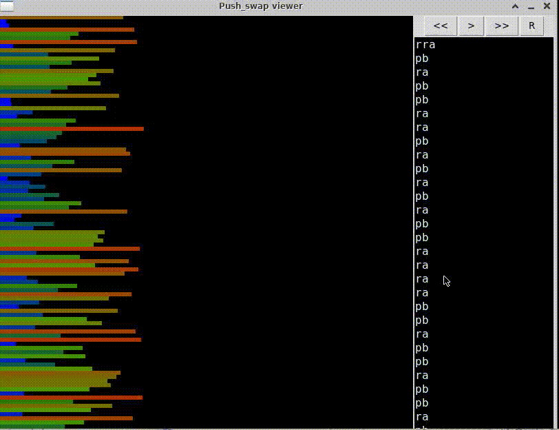
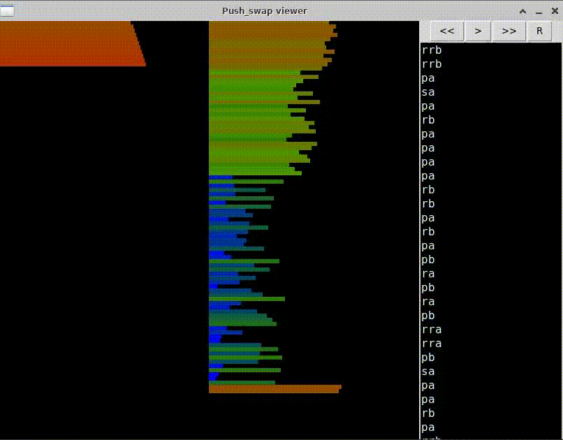
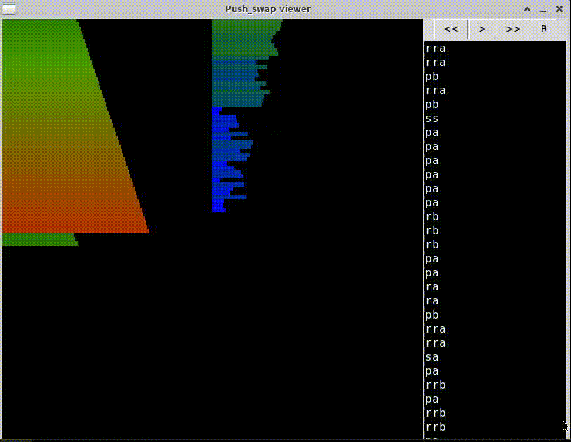

# push_swap

Teremos uma stack A e uma Stack B. A stack A tera os numeros passados como parametro, enquanto a Stack B começara vazia. 

O objetivo é organizar a stack A com apenas algumas ações especificas.

<ul>
  <li>sa - Swap nos primeiros dois elementos da stack A.</li>  
  <li>sb - Swap nos primeiros dois elementos da stack B.</li>  
  <li>ss - sa e sb ao mesmo tempo.</li>  
  <li>pb - Joga o primeiro elemento do stack A para o Stack B.</li>  
  <li>pa - Joga o primeiro elemento do Stack B para o stack A.</li>  
  <li>ra - Shift up todos elementos do Stack A</li>  
  <li>rra - Shift down todos elementos do Stack A</li>  
  <li>rb - Shift up todos elementos do Stack B</li>  
  <li>rrb - Shift down todos elementos do Stack B</li>  
  <li>rrb - Shift down todos elementos do Stack B</li>  
  <li>rr - ra e rb ao mesmo tempo</li>  
  <li>rrr - rra e rrb ao mesmo tempo</li>  
</ul>

